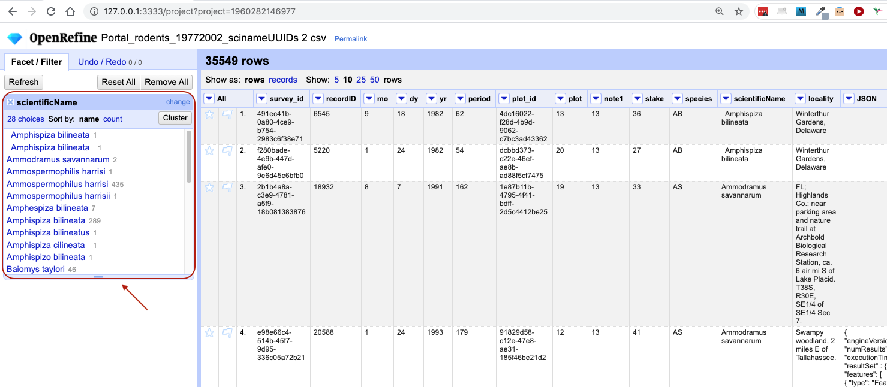
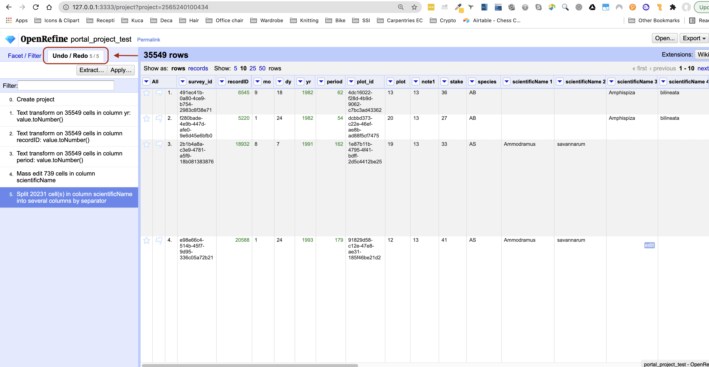

## Creating a project

Start OpenRefine, which will open in your browser (at the address `http://127.0.0.0:3333`). Once OpenRefine is launched in your
browser, the left margin has options to `Create Project`, `Open Project`, or `Import Project`. Here we will create a new
project and import our portal rodents data. 

1. Click `Create Project` from the left margin and select then `This Computer` (because you're uploading data from your
   computer).  
2. Click `Choose Files` and browse to where you stored the file `Portal_rodents_19772002_scinameUUIDs.csv`. Select the
   file and click `Open`, or just double-click on the filename.
3. Click `Next>>` under the browse button to upload the data into OpenRefine.  
4. On the next screen, OpenRefine will present you with a preview of your data. You can check here for obvious errors,
   if, for example, your file was tab-delimited rather than comma-delimited, the preview would look strange (and you
   could correct it by choosing the correct separator and clicking the `Update Preview` button on the right. If you
   selected the wrong file, click `<<Start Over` at the top left.

    

4. In the middle of the page, will be a set of options (`Character encoding`, etc.). Make sure the tick box next to
   `Trim leading & trailing whitespace from strings` is not ticked. (We're going to need the leading whitespace in one
   of our examples.) 
5. If all looks well, click `Create Project>>` in the top right. You will be presented with a view onto your data. This
   is OpenRefine!

Let's now start exploring and getting a higher-level overview of our data - summarising and looking for potential 
outliers and errors.

> ## Data file types supported
> OpenRefine can import a variety of different file types, including tab separated (`tsv`), 
> comma separated (`csv`), Excel (`xls`, `xlsx`), JSON, XML, RDF as XML, and Google Spreadsheets. 
> See the [OpenRefine Importers page](https://github.com/OpenRefine/OpenRefine/wiki/Importers) for more information.
{: .callout}

## Data faceting

Facets are one of the most useful features of OpenRefine. Data faceting is a process of exploring data by applying
multiple filters to investigate its composition. It also allows you to identify a subset of data that you wish to change
in bulk.

> ## OpenRefine Wiki: Faceting 
> Full documentation on faceting can be found at [OpenRefine Wiki: Faceting](https://github.com/OpenRefine/OpenRefine/wiki/Faceting)
{: .callout}

### Text facets
A 'text facet' groups all the identical text values in a column and lists each value with the number of records in which
it appears. The facet information always appears in the left hand panel in the OpenRefine interface. We will use text
faceting to look for potential errors in the `scientificName` column.

1. Click the down arrow next to the `scientificName` column.
2. Choose `Facet` > `Text facet`.
3. In the left panel, you'll now see a box containing every unique value in the `scientificName` column 
along with a number representing how many times that value occurs in the column.

    

4. You can click in this panel to sort the facet by `name` and `count`. Do you notice any problems with the data? What
   are they?
5. Hover the mouse over any one of the names in the left panel. You should see that you have an `edit` function
   available. 
6. You could use this to fix an error immediately, and OpenRefine will ask whether you want to make the same correction
   to every value equal to the one you identified. But OpenRefine offers even better ways to find and fix errors across
   the whole dataset, which we will use instead. We will learn about these when we talk about clustering.

There will be several near-identical entries in `scientificName`. For example, there is one entry for `Ammospermophilis harrisi` and
one entry for `Ammospermophilus harrisii`. These are both misspellings of `Ammospermophilus harrisi`. We will see how to correct these 
misspelled and mistyped entries in a later exercise.  

### Other types of facets
As well as 'Text facets' OpenRefine also supports a range of other types of facet. These include:
 
* Numeric facets
* Scatterplot facets
* Timeline facets (for dates)
* Customized facets

**Numeric and scatterplot facets** display graphs instead of lists of values. The numeric facet graph includes 'drag and drop' controls you can use to set a start and end range to filter the data displayed. These facets are explored further in [Examining Numbers in OpenRefine](http://www.datacarpentry.org/OpenRefine-ecology-lesson/03-numbers/).

**Customized facets** are a range of different types of facets, some of which are:

* Word facet - this breaks down text into words and counts the number of records in which each word appears
* Duplicates facet - this results in a binary facet of 'true' or 'false'. Rows appear in the 'true' facet if the value in the selected column is an exact match for a value in the same column in another row
* Text length facet - creates a numeric facet based on the length (number of characters) of the text in each row for the selected column. This can be useful for spotting incorrect or unusual data in a field where specific lengths are expected (e.g. if the values are expected to be years, any row with a text length more than 4 for that column is likely to be incorrect)
* Facet by blank - a binary facet of 'true' or 'false'. Rows appear in the 'true' facet if they have no data present in that column. This is useful when looking for rows missing key data.

Facets are used to group together common values. OpenRefine limits the number of values allowed in a single facet to
ensure the software does not perform slowly or run out of memory. If you create a facet where there are many unique
values (for example, a facet on a 'book title' column in a data set that has one row per book) the facet created will be
very large and may either slow down the application, or OpenRefine will refuse to create the facet.

> ## Exercise
>
> 1. Using faceting, find out how many years are represented in the census (via the `yr` column).  
>
> 2. Is the column formatted as a number, date or text?
>
> 3. Which year has the most and which year has the least observations?
> 
> > ## Solution
> > 
> > 1. For the column `yr` do `Facet` > `Text facet`. A box will appear in the left panel showing that there are 26 unique entries in
> >    this column.  
> > 2. You may have noticed that a numeric facet did not work on the column. By default, the columns in OpenRefine are
> >    formatted as text.
> > 3. You can change the format to numbers by selecting the down arrow next to
> >    the `yr` column name, selecting `Edit cells` > `Common transforms` > `To number`. Notice when this change was
> >    applied that the values in the column changed from black to green, and from left-justified to right-justified. 
> >    If you now select `Facet` > `Numeric facet` on column `yr`, a new box is created that shows a histogram of the number of 
> >    entries per year. Notice that the data is shown as a number, not a date.
> > 4. You can also transform the column to a date by selecting `Edit cells` > `Common transforms` > `To date`. Note the
> >    program will assume all entries take place on 1st January of the year. You can now choose a timeline facet.
> > 5. Click `Sort by count` in the text facet box to order the counts numerically. The year with the most observations
>      is 1997, and the year with the least is 1977. 
> > 
> {: .solution}
{: .challenge}

> ## Default data type 
>
> Be default, all data imported in OpenRefine is treated as text. You have to tell OpenRefine explicitly 
> to treat columns differently via `Edit cells` > `Common transforms`, e.g. as numbers. If you change the 
> data type - it will appear in green. 
>
{: .callout}

## Data clustering

Clustering allows you to find groups of entries that might be alternative representations of the same thing. For
example, the two strings `New York` and `new york` are very likely to refer to the same concept and just have a
capitalisation differences. Likewise, `Björk` and `Bjork` probably refer to the same person. These kinds of variations
occur a lot in scientific data. Clustering gives us a tool to resolve them.

OpenRefine provides different clustering algorithms. The best way to understand how they work is to experiment with
them. 

1. In the `scientificName` text facet box we created in the step above, click the `Cluster` button.
2. In the resulting pop-up window, you can change the `Method` and the `Keying Function`. Try different combinations to 
 see what different mergers of values are suggested.
3. If you select the `key collision` method and the `metaphone3` keying function. It should identify three clusters. 

    

4. Tick the `Merge?` checkbox beside each group, then click `Merge Selected and Recluster` to apply the corrections to
   the dataset. Note that the `New Cell Value` column displays the new name that will replace the value in all the cells in the
   group. You can change this (but please don't do so now) if you wish to choose a different value than the suggested one.
5. Try selecting different `Methods` and `Keying Functions` again, to see what new merges are suggested. You may find there are 
 still improvements that can be made, but do not `Merge` again; just `Close` when you are done.  We will now 
 see other operations that will help us detect and correct the remaining problems, and that have other, more general uses.

**Important:** If you `Merge` using a different method or keying function, or more times than described in the instructions above, 
your solutions for later exercises will not be the same as shown in those exercise solutions.

> ## OpenRefine Wiki: Clustering 
> Full documentation on clustering can be found at [OpenRefine Wiki: Clustering](https://github.com/OpenRefine/OpenRefine/wiki/Clustering-In-Depth)
{: .callout}

## Data splitting

It is easy to split data from one column into multiple columns if the parts are separated by a common separator (say a
comma, or a space).

1. Let us suppose we want to split the `scientificName` column into separate columns, one for genus and one for species. 
2. Click the down arrow next to the `scientificName` column. Choose `Edit Column` > `Split into several columns...`
3. In the pop-up, in the `Separator` box, replace the comma with a space (the box will look empty when you're done).
4. Important! Uncheck the box that says `Remove this column`.
5. Click `OK`. You should get some new columns called `scientificName 1`, `scientificName 2`, `scientificName 3`, and `scientificName 4`.
6. Notice that in some cases these newly created columns are empty (you can check by text faceting the
   column). Why? What do you think we can do to fix it?

The entries that have data in `scientificName 3` and `scientificName 4` but not the first two `scientificName` columns 
had an extra space at the beginning of the entry. Leading and trailing white spaces are very difficult to notice when cleaning data
manually. This is another advantage of using OpenRefine to clean your data - this process can be automated. 
In newer versions of OpenRefine (from version 3.4.1) there is now an option to 
clean leading and trailing white spaces from all data when importing the data initially and creating the project. 
Because we didn't clean white space at the time of importing the data, we will look at how to 
fix leading and trailing white spaces manually in a moment.

## Undo / Redo

It is common while exploring and cleaning a dataset to make a mistake or decide to change the order of the process
you wish to conduct. OpenRefine provides `Undo` and `Redo` operations to make it easy to roll back your changes.

1. Click `Undo / Redo` in the left side of the screen. All the changes you have made will appear in the left-hand panel.
   The current stage in the data processing is highlighted in blue (i.e. step 4. in the screenshot below). As you click
   on the different stages in the process, the step identified in blue will change and, far more importantly, the data
   will revert to that stage in the processing. 

    

2. We want to undo the splitting of the column `scientificName` (it may be one or two steps back). Select the stage just
   before the split occurred and the new `scientificName` columns will disappear.
3. Notice that you can still click on the last stage and make the columns reappear, and toggle back and forth between these states.
4. Let's leave the dataset in the state in which the `scientificNames` were clustered, by selecting the stage just before the
   split.

**Important:** If you skip this step, your solutions for later exercises will not be the same as shown in those exercise solutions.

## Trim Leading and Trailing Whitespace

Words with spaces at the beginning or end are particularly hard for humans to identify from strings without these
spaces. However, blank spaces can make a big difference to computers, so we usually want to remove them.

1. In the header for the column `scientificName`, choose `Edit cells` > `Common transforms` > `Trim leading and trailing whitespace`.
2. Notice that the `Split` step has now disappeared from the `Undo / Redo` pane on the left and is replaced with a `Text transform on 3 cells`
3. Perform the same `Split` operation on `scientificName` that you undid earlier. This time you should now only get two new columns.

Removing the leading white spaces means that each entry in this column has exactly one space (between the genus and species parts). 
Therefore, when you split with space as the separator, you will get only two columns.

> ## Exercise
>
> Change the name of the `scientificName 1` column to `genus`. Try to change the name of the `scientificName 2` column to `species`. What problem do you encounter? How can you fix the problem?
> 
> > ## Solution
> > 
> > On the `scientificName 1` column, click the down arrow and then `Edit column` > `Rename this column`. Type "genus" into the box
> > that appears. Repeat the process for the `scientificName 2` column, and type "species" into the box
> > that appears. A pop-up will appear that says `Another column already named species`. This is because there is another column
> > where we've recorded the species abbreviation. You can choose another name like `speciesName` for this column or change the other 
> > `species` column name to `species_abbreviation`.
> {: .solution}
{: .challenge}

**Important:** `Undo` the splitting and renaming steps and retain the white space trimming step before moving on to the next lesson (it may be several steps back). If you skip this step, your solutions 
for later exercises will not be the same as shown in those exercise solutions.
