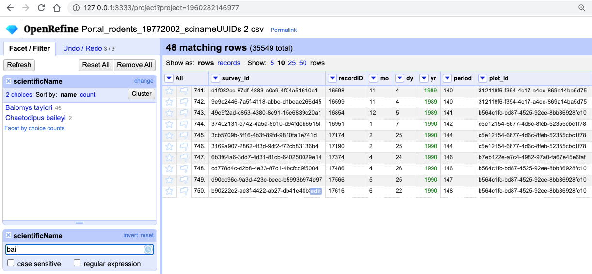
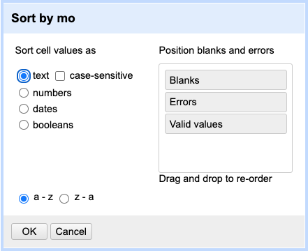
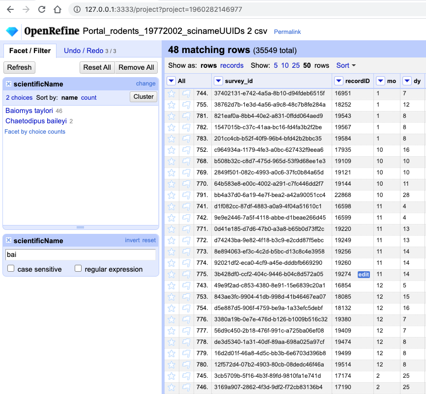
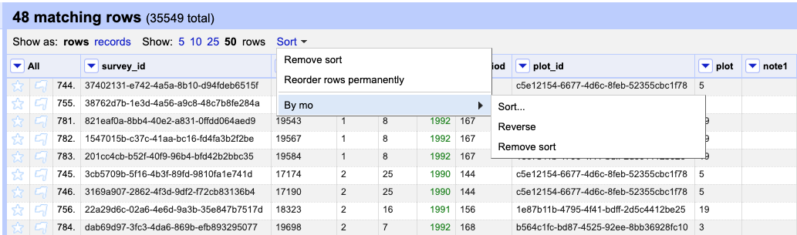

## Filtering data

Sometimes you want to view and work only with a subset of data or apply an operation only to a subset. 
You can do this by applying filters to your data.

1. Click the down arrow next to `scientificName` > `Text filter`. A `scientificName` facet will appear on the left margin.
2. Type in `bai` into the text box in the facet and press return. At the top of the page it will report that, out of the 35549
   rows in the raw data, there are 48 rows in which the text has been found within the `scientificName` column (and these rows will be selected for the
  subsequent steps).

    

3. Near the top of the screen, change `Show:` to 50. This way you will allow you to see all the matching rows.

> ## Exercise
>
> 1. What scientific names are selected by this text filter?  
> 2. How would you restrict it to one of the species selected?  
> 
> > ## Solution
> > 1. If you kept a text facet over `scientificName` from before - it will show that
> > two names match your filter criteria are: `Baiomys taylori` and `Chaetodipus baileyi`. If you have closed 
> > the text facet, select `Facet` > `Text facet` on the `scientificName` column.    
> > 2. There are various options to restrict to only one of the two species identified. You could make the search case sensitive. 
> > You could split the `scientificName` column into species and genus columns, as before, and filter only the column of interest. 
> > You could include more letters in your filter, e.g. `baio` which would exclude `Chaetodipus baileyi`. Try playing with these different options.
> > 
> {: .solution}
{: .challenge}

### Excluding data entries

Another way to narrow our filter is to use the `include` or `exclude` buttons on the entries in a facet. If you still
have your facet for `scientificName`, you can use it. If you've closed that facet, recreate it by selecting `Facet` >
`Text facet` on the `scientificName` column. 

1. In the text facet, hover over one of the names, e.g. `Baiomys taylori`. Notice that when you hover over it, there are
   buttons to the right for `edit` and `include`.
2. Whilst hovering over `Baiomys taylori`, move to the right and click the `include` option. This will include this
   species, as signified by the name of the species changing from blue to orange, and new options of `edit` and
   `exclude` will be presented. Note that in the top of the page, "46 matching rows" is now displayed instead of "48
   matching rows".
3. You can include `Chaetodipus baileyi` in the same way too.
4. Alternatively, you can click the name of either one of the species. This will include the selected species and
   exclude all others options in a single step, which can be useful.
3. Click `include` and `exclude` on the other species (`Chaetodipus baileyi`) and notice how the two entries appear and
   disappear from the data table to the right.

**Important:** Make sure both species are included in your filtered dataset before continuing with the rest of the exercises.

>## Filters vs. facets
> Faceting and filtering look very similar. A good distinction is that faceting gives you an overview description of all the data that 
> is currently selected, while filtering allows you to select a subset of your data for analysis. 
>
{: .callout}

## Sorting data

You can sort the data in a column by using the drop-down menu available in that column.
There you can sort by `text`, `numbers`, `dates` or `booleans` (`TRUE` or `FALSE` values). You can also specify what order to put `Blanks` and `Errors` in the sorted results.

If this is your first time sorting this table, then the drop-down menu for the selected column shows `Sort...`. Select what you would like to sort by (such as `numbers`). Additional options will then appear for you to fine-tune your sorting.

> ## Exercise
>
> Sort by month. What happens if you sort that column as text? How can you ensure that months are in order? 
> > ## Solution  
> > From the drop-down menu on the column `mo` select the `Sort` then `Sort...` option. Select 
> > `Sort cell values as text` first. You can also rearrange Errors and Blanks to come at top when sorting (by 
> > drag and dropping them in the box on the right) - this is a good practice detect some outliers.      
> >
>   
> >
> > You will notice that values for month have been sorted in alphabetical order, where months 10, 11 and 12 came before month 2. 
> >
>   
> >  
> > This is probably not what you wanted - so you will have to redo the sort using `Sort cell values as number` option.
> > 
> > You may have noticed that in the case of sorting as numbers, the actual column itself remained as text. OpenRefine did not convert the column to numbers (notice the absence of green font). 
> > 
> > Another thing to note is that sorting is not an action that you can undo/redo - it does not appear on Undo/Redo tab.
> {: .solution}
{: .challenge}

If you try to re-sort a column that you have already used, the drop-down menu changes slightly, to `Sort` without the `...`, to remind you that you have already used this column. It will give you additional options:

* `Sort` > `Sort...` - This option enables you to modify your original sort. 
* `Sort` > `Reverse` - This option allows you to reverse the order of the sort.
* `Sort` > `Remove sort` - This option allows you to undo your sort.

It may not always be that obvious in OpenRefine that you did a sort, or you may forget that you did it. Once you do the sort for the first time - a little `Sort` button will appear at the top as an indicator that your sorted you data in some way as shown in the image below. It will disappear if you remove the sort.

 
 
> ## Exercise
> 
> Remove the sort by month. Then sort the data by `plot`. What year(s) were observations recorded for plot 1 in this filtered dataset?
> 
> > ## Solution
> > In the `plot` column, select `Sort...` > `numbers` and select `smallest first`. The years observations were recorded in plot 1 are 1990 and 1995.
> > 
> {: .solution}
{: .challenge}

### Sorting by multiple columns

You can sort by multiple columns by performing sort on additional columns. The sort will depend on the order in which you select columns to sort. To restart the sorting process with a particular column, check the `sort by this column alone` box in the `Sort` pop-up menu.

> ## Exercise
>
> You might like to look for trends in your data by month of collection across years.     
> 1. How do you sort your data by month?   
> 2. How would you do this differently if you were instead trying to see all of your entries in chronological order?  
> 
> > ## Solution
> > 
> > 1. For the `mo` column, click on `Sort...` and then `numbers`. This will group all entries made in, for example, January,
> > together, regardless of the year that entry was collected.  
> > 2. For the `yr` column, click on `Sort` > `Sort...` > `numbers` and select `sort by this column alone`. This will undo the 
> > sorting by month step. Once you have sorted by `yr` you can then apply another sorting step to sort by month within year. To do this
> > for the `mo` column, click on `Sort` > `numbers` but do not select `sort by this column alone`. To ensure that all entries are shown 
> > chronologically, you will need to add a third sorting step by day within month. 
> > 
> {: .solution}  
{: .challenge}

If you go back to one of the already sorted columns and select > `Sort` > `Remove sort`, that column is removed from your multiple sort. If it is the only column sorted, then data reverts to its original order.

> ## Exercise
>
> Sort by `year`, `month` and `day` in some order. Be creative: try sorting as `numbers` or `text`, and in reverse order (`largest to smallest` or `z to a`).
>
> Use > `Sort` > `Remove sort` to remove the sort on the second of three columns. Notice how that changes the order.
{: .challenge}

