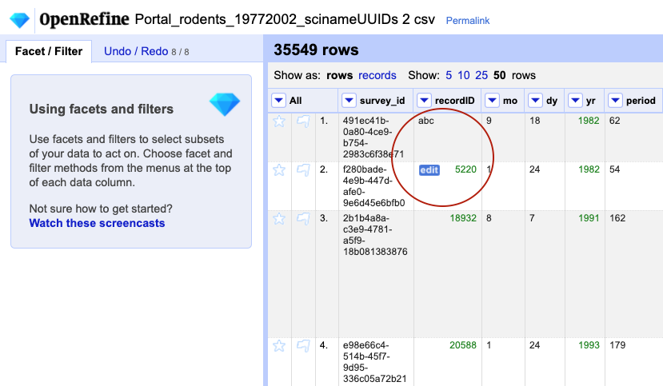
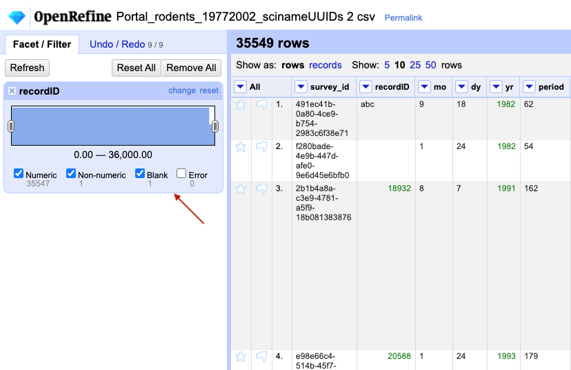
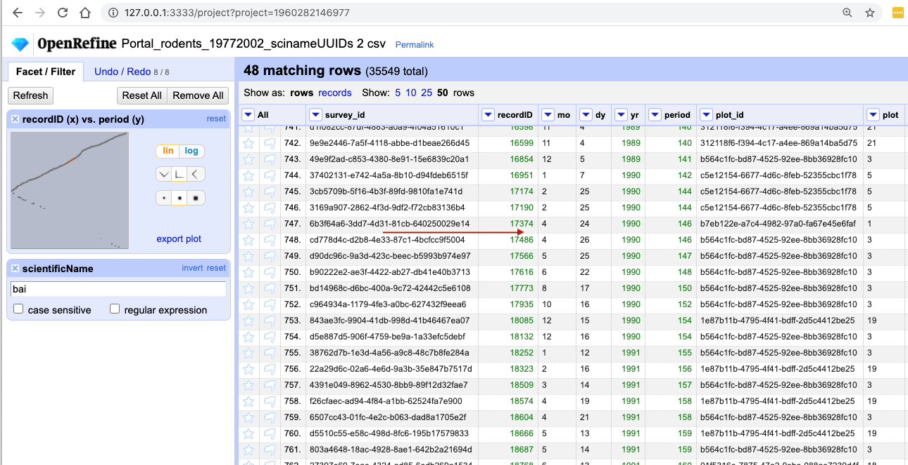

## Number data

When a table is imported into OpenRefine, all columns are treated as having text values. We saw earlier how we can sort column values as numbers, but this does not change the cells in a column from text to numbers. Rather, this interprets the values as numbers for the purposes of sorting but keeps the underlying data type as is. We can, however, transform columns to other data types (e.g. number or date) using the `Edit cells` > `Common transforms` feature. Here we will experiment changing columns to numbers and see what additional capabilities that grants us.

Be sure to remove any `Text filter` facets you have enabled from the left panel so that we can examine our whole dataset. You can remove an existing facet by clicking the `x` in the upper left of that facet window.

To transform cells in the `recordID` column to numbers, click the down arrow for that column, then `Edit cells` > `Common transforms…` > `To number`. You will notice the `recordID` values change from left-justified to right-justified, and black to green color.

> ## Exercise
>
> Transform three more columns, including `period`, from text to numbers. Can all columns be transformed to numbers?
> 
> > ## Solution
> > 
> > Only observations that include only numerals (0-9) can be transformed to numbers. If you apply a number transformation to 
> > a column that does not meet this criteria, and then click the `Undo / Redo` tab, you will see a step that starts with 
> > `Text transform on 0 cells`. This means that the data in that column was not transformed.
> > 
> {: .solution}
{: .challenge}

### Numeric facet
Sometimes there are non-number values or blanks in a column which may represent errors in data entry and we want to find them. 
We can do that with a `Numeric facet`.

1. For a column you transformed to numbers, edit one or two cells, replacing the numbers with text (such as `abc`) or blank (no number or text).

    

2. Use the pulldown menu to apply a numeric facet to the column you edited. The facet will appear in the left panel.

    

3. Notice that there are several checkboxes in this facet: `Numeric`, `Non-numeric`, `Blank`, and `Error`. Below these are counts of the number of cells in each category. You should see checks for `Non-numeric` and `Blank` if you changed some values.
4. Experiment with checking or unchecking these boxes to select subsets of your data.

When done examining the numeric data, remove this facet by clicking the `x` in the upper left corner of its panel. Note that this does not undo the edits you made to the cells in this column. If you want to reverse these edits, use the `Undo / Redo` function.

### Scatterplot facet

Now that we have multiple columns representing numbers, we can see how they relate to one another using the scatterplot facet. Select a numeric column, for example `recordID`, and use the pulldown menu to > `Facet` > `Scatterplot facet`. A new window called `Scatterplot Matrix` will appear. There are squares for each pair of numeric columns (this may differ from your machine depending which columns you have transformed to numbers). Each square has little dots for the cell values from each row.

1. Examine the scatterplots overall. Do the patterns make sense?
2. Why does the scatterplot for `recordID` vs `period` have the pattern it does?

We can examine one pair of columns by clicking on its square in the `Scatterplot Matrix` A new facet with only that pair will appear in the left margin as a little interactive graph. Click in the scatterplot facet in the left margin and drag to highlight a rectangle. This will subset the data and filter to those selected entries.

The scatterplot `recordID` vs `period` has a slightly unexpected shape - you would probably expect a 
linear graph. Instead, you have some negative values on the
`period` (y) axis and the scatterplot helped us uncover some outliers in data. When we selected a subset of data on the scatterplot diagram - you can see that there is some data with a negative number for `period`, which potentially is an error in your data. You can click anywhere on the graph to get rid of the subsetting. 

> ## Exercise
> 
> - Click on the `Scatterplot Matrix` square for `recordID` and `period` to get that as a facet in the left margin.
> - Redo the `Text filter` on `scientificName` to show only entries including the letters `bai`.
> Notice the change in the scatterplot. It might be easier to see if you click `export plot` to 
> put it on a new browser tab.   
>
> > ## Solution       
> > You have filtered out only the 48 entries which `scientificName` includes the letters `bai` and you 
> > can see where in the
> > graph they appear.
> >
>     
> >
> {: .solution}
{: .challenge}
